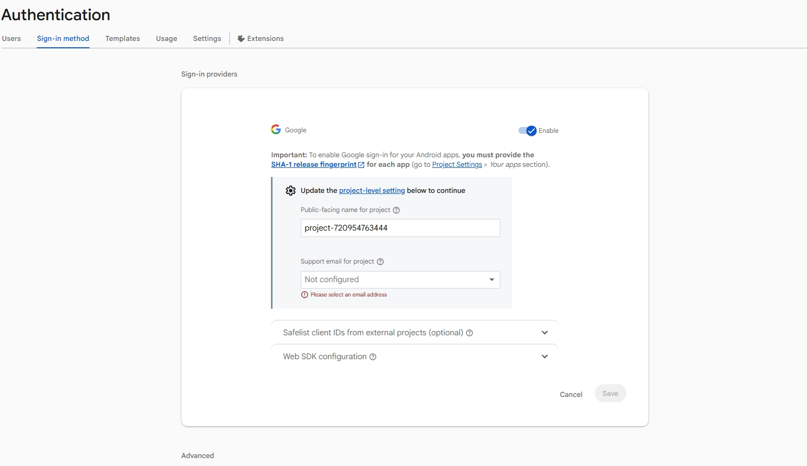

](image.png)# CreatorConnect Development Tasks

- [x] Scaffolding and Dependencies
  - [x] Initialize Next.js 15 with Tailwind, TypeScript, and App Router
  - [x] Install core dependencies (`framer-motion`, `lucide-react`, `next-themes`, `canvas-confetti`)
- [x] Global Styling and Tokens
  - [x] Update Tailwind styles with custom colors, gradients, and animations
  - [x] Setup `src/app/globals.css` with premium glassmorphism and theme styles
- [x] Core Logic & Database Layer
  - [x] Create `src/lib/constants.ts` with category listing and rich mock creator/business profiles
  - [x] Implement `src/lib/db.ts` database interface with automatic LocalStorage simulator fallback
  - [x] Implement `src/lib/auth.tsx` Context Provider for custom role-based Authentication
- [x] Reusable Layouts & Components
  - [x] Create Navigation header (`Navbar.tsx`) with dark mode and dropdown selectors
  - [x] Create Footer (`Footer.tsx`)
  - [x] Create `CreatorCard.tsx` (Premium hover effects, verified check, social stats)
  - [x] Create `BookingModal.tsx` (Calculate platform commission, GST, and payouts in real-time)
  - [x] Create `ReviewModal.tsx` (Review ratings, stars, and review comments)
- [x] Public-Facing Pages
  - [x] Build Premium landing page (`src/app/page.tsx`) with search, categories, testimonials
  - [x] Build Authentication screens (`src/app/login/page.tsx`, `src/app/signup/page.tsx`)
  - [x] Build Creator directory search page (`src/app/creators/page.tsx`) with filter/sort sidebars
  - [x] Build Public Creator Profile (`src/app/creator/[id]/page.tsx`) showing media galleries, pricing, and book button
- [x] Business Dashboard Pages
  - [x] Build Dashboard dashboard home (`src/app/business/dashboard/page.tsx`)
  - [x] Build Business profile management (`src/app/business/profile/page.tsx`)
  - [x] Build Business campaign bookings tracker (`src/app/business/bookings/page.tsx`)
- [x] Creator Dashboard Pages
  - [x] Build Creator dashboard home (`src/app/creator/dashboard/page.tsx`)
  - [x] Build Creator profile setup (`src/app/creator/profile/page.tsx`)
  - [x] Build Creator incoming campaign bookings manager (`src/app/creator/bookings/page.tsx`)
  - [x] Build Creator marketing/social links manager (`src/app/creator/links/page.tsx`)
- [x] Admin Portal Pages
  - [x] Build Admin analytics home (`src/app/admin/dashboard/page.tsx`)
  - [x] Build Business & Creator activation tables (`src/app/admin/users/page.tsx`)
  - [x] Build Booking monitoring and custom overrides manager (`src/app/admin/bookings/page.tsx`)
  - [x] Build Platform configuration & policy variables screen (`src/app/admin/settings/page.tsx`)
- [x] Production and Verification
  - [x] Add `firestore.rules` and `firestore.indexes.json`
  - [x] Run typescript & build check (`npm run build`)
  - [x] Generate Walkthrough
